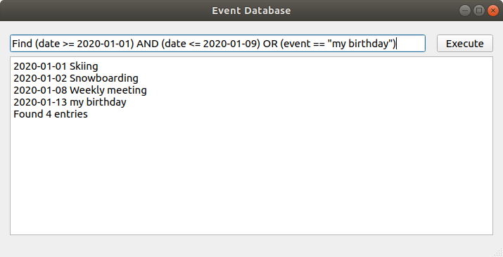

# event-database

**DateEvent** is an event database that can select and delete events that match a given condition.

## Supported queries:

- **Add *date* *event*** — add to the database the event *event* for the date *date*;
- **Print** — display the entire contents of the database;
- **Find `condition`** — display all records contained in the database that satisfy the `condition`;
- **Del `condition`** — remove from the database all records that satisfy the  `condition`;
- **Last *date*** — display a record with the last event occurring no later than this `date`.

The event is represented as a string. Date as a string in the format `yyyy-mm-dd`.  
`Conditions` in the **Find** and **Del** commands impose established restrictions on the date and events. Available operations on dates and events: `<`,`>`,`==`,`!=`,`<=`,`>=`.  Logical operations: `OR`, `AND`. For example:

- **Find date < 2013-11-13** — find all events that happened before November 13, 2013;
- **Del event != "snowboarding"** — remove all events from the database, except for "snowboarding";
- **Find date >= 2013-01-01 AND date < 2013-07-01 AND event == "snowboarding"** — find all the "snowboarding" events that happened in the first half of 2013;
- **Del date < 2013-01-01 AND (event == "snowboarding" OR event == "sport event")** — remove from the database all events "snowboarding" and "skiing" that happened before 2013.

## Screenshot:


# Installation


## with cmake
1. Go to the project directory:  
    ```
    cd event-database 
    ```
2. Create a directory for your build files and go inside it:
    ```
    mkdir build;
    cd build;
    ```
3. Then run cmake and point to the parent directory:
    ```
    cmake ..;
    ```
4. Finally run make:
    ```
    make
    ```

***

  
## with qmake
1. Go to the project directory:  
    ```
    cd event-database 
    ```
2. Create a directory for your build files and go inside it:
    ```
    mkdir build;
    cd build;
    ```
3. Then run cmake and point to the parent directory:
    ```
    qmake ..;
    ```
4. Finally run make:
    ```
    make
    ```

***

## Launch
Go to the build directory and run:
```
./event-database
```


